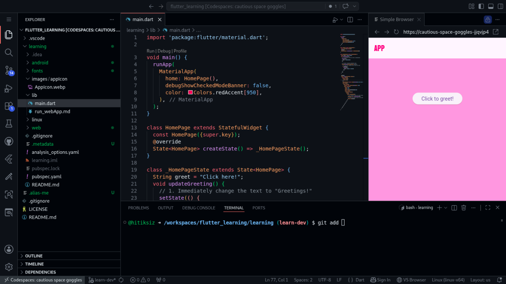

# Flutter Learning 🚀

A beginner-friendly Flutter learning repository focused on building modern UI, understanding Flutter fundamentals, and experimenting with cross-platform app development.

---

<p align="center">
  
  
  
  
</p>


## 📸 Preview
<p align="center">
  
</p>

---

# 📂 Project Structure

```
flutter_learning/
│-- LICENSE
│-- README.md
└── learning
    │-- README.md
    │-- analysis_options.yaml
    │-- android/
    │-- fonts/
    │-- images/
    │-- lib/
    │-- linux/
    │-- web/
    └── pubspec.yaml
```
# 📁 Important Directories

| Folder     | Purpose                  |
| ---------- | ------------------------ |
| `lib/`     | Main Dart source code    |
| `fonts/`   | Custom fonts used in app |
| `images/`  | App assets and icons     |
| `android/` | Android platform files   |
| `linux/`   | Linux desktop support    |
| `web/`     | Flutter web files        |


# ▶️ Run The Project
1. Clone Repository

```git clone https://github.com/your-username/flutter_learning.git```

2. Move Into Project
```cd flutter_learning/learning```

3. Install Dependencies
```flutter pub get```

4. Run Web Version
```flutter run -d chrome```

> [!NOTE]
> Init made for web only...
>
> ```bash
> flutter run -d web-server --web-hostname 0.0.0.0 --web-port 3000
> ```

# 🔤 Custom Fonts

Included fonts:

- BBH Bogle
- Titan One

Configured through:

- `pubspec.yaml`

# 🖼️ Assets

Current assets include:
- Custom Fonts


# 📚 Current Learning Topics

- MaterialApp
- StatefulWidget
- setState()
- Buttons & UI interaction
- Layout basics
- Asset management
- Flutter web deployment basics


